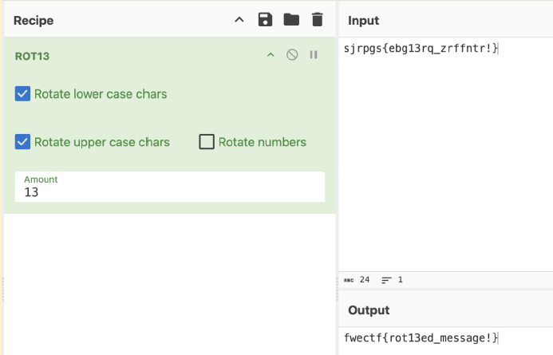
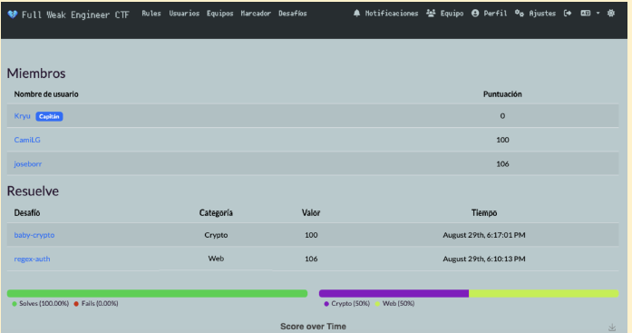

# Desafío: baby-crypto
- **Categoría**: Crypto
- **Flag**: fwectf{rot13ed_message!}

- El mensaje inicial es el siguiente: **sjrpgs{ebg13rq_zrffntr!}**. Como el formato no es extraño, probamos con CyberChef distintas formas de codificación clásicas, empezando por ROT13, la cual dió resultado:

- Con esto pudimos insertar la flag y actualizar el score en el CTF:
