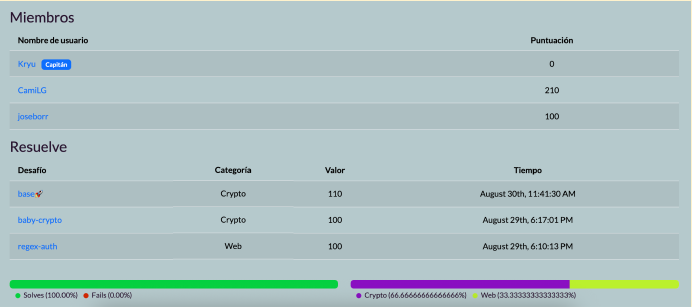

# Desafío: base🚀
- **Categoría**: Crypto
- **Flag**: fwectf{n0_r0ck37_3m0ji_n0_llm}

Para este desafío se tiene un diccionario de emojis, un script que codifica los mensajes utilizando el diccionario, y la flag codificada.  
El script que codifica lee el archivo de emojis, los carga en una lista y los enumera en un diccionario de forma que se puedan codificar los mensajes reemplazando cada letra por un emoji. También agrega un padding en caso de ser necesario para unificar el formato.
Para obtener la flag, el primer paso es desarrollar un script que realice el proceso inverso del script que codifica. Teniendo el diccionario, se puede probar el funcionamiento para el mismo ejemplo del script que codifica:  

---

Ejecución del script provisto:  
/chall.py  
msg: Hello!  
enc: 🐴🙅🥬🍴🎉🚀🚀🚀  
Ejecución del script para decodificar la flag:  
/decode.  
Bytes decodificados: bytearray(b'Hello!')   
Texto decodificado: Hello!  

---

De esa forma llegamos a la flag:

---

/decode.py  
Bytes decodificados: bytearray(b'\xf0\x9f\x9a\x80Congratulations!  
fwectf{n0_r0ck37_3m0ji_n0_llm}')  
Texto decodificado: 🚀Congratulations! fwectf  {n0_r0ck37_3m0ji_n0_llm}  

---

Quedando actualizado el score del team:
