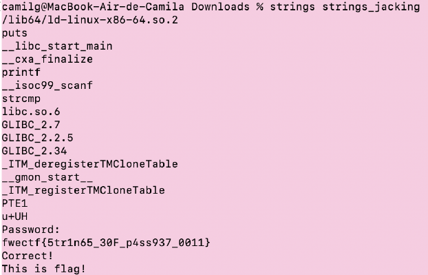
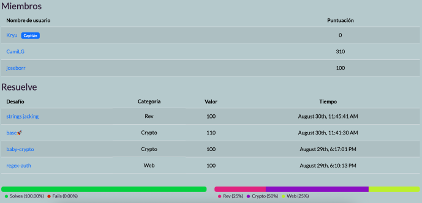

# Desafío: strings jacking
- **Categoría**: Reversing
- **Flag**: fwectf{5tr1n65_30F_p4ss937_0011}

Este desafío nos permite descargar un archivo para analizarlo. La pista que se da en el nombre es “strings” por lo que podemos interpretar que hay algún mensaje oculto en la sección de metadata del archivo.
Utilizando el comando strings, podemos inspeccionar la información del archivo y así llegar a la flag escondida:

Y así ingresar la flag en el CTF y actualizar el score:

