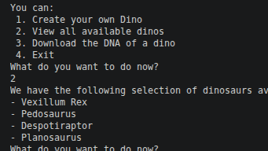
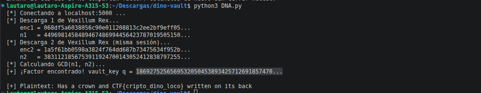
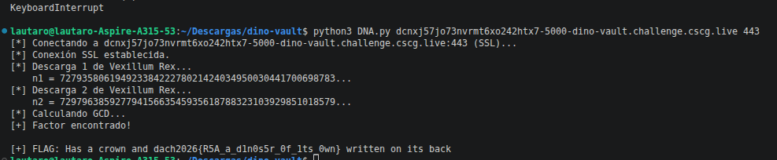

# Desafio: DinoVault
### RSA Shared Factor Attack | CSCG Challenge

Este desafio presenta la descripción *"Do you have a park with dinosaurs of your own? Then make sure back your dinos up regularly! You never know when the next mass extinction event will happen, so better safe than sorry.
We encrypt all your dinosaur data so that you need not worry that anyone is able to copy your designs. Our encrypted designs are uploaded as well for anyone to verify that we use dinosaur-grade cryptography!"* y los archivos **Dockerfile** y **app.py** los cuales implementan un servidor DinoVault el cual almacena dinosaurios con ADN encriptado usando RSA, donde el Vexillum Rex tiene la flag escrita en su ADN. La tarea es romper el cifrado y recuperarla.

---

## Paso 1 — Análisis local

Antes de atacar el servidor del CTF, levantamos el servidor localmente con Docker
para entender bien cómo funcionaba:

    docker build -t dino-vault .
    docker run -p localhost:5000 dino-vault

Nos conectamos con netcat:

    nc localhost 5000

El servidor nos presenta un menú con 4 opciones:

    1. Create your own Dino
    2. View all available dinos
    3. Download the DNA of a dino
    4. Exit

Exploramos las opciones y notamos que existía un dinosaurio llamado "Vexillum Rex"
cuya descripción era: "Has a crown and <FLAG> written on its back".

Al descargar su ADN (opción 3), el servidor nos devolvía dos cosas:
- El ADN encriptado en hexadecimal (ciphertext)
- Un número enorme llamado "modulation index" (n)

Leyendo el código fuente (app.py) entendimos la estructura del cifrado:

    n = transmission_key * vault_key      <- ambos son primos de 2048 bits
    ciphertext = pow(mensaje, 65537, n)

El vault_key es fijo por sesión (se genera una sola vez al conectarse).
El transmission_key es nuevo cada vez que se descarga.

---

## Paso 2 — Identificación de la vulnerabilidad

Al darnos cuenta de que vault_key se reutilizaba en cada descarga dentro de la misma
sesión, identificamos un ataque clásico de RSA: el ataque por factor compartido (GCD Attack).

Si descargamos el mismo dino DOS VECES en la misma sesión obtenemos:

    n1 = p1 * vault_key
    n2 = p2 * vault_key

Donde p1 y p2 son transmission_keys distintos, pero vault_key es el mismo.
Aplicando el Máximo Común Divisor:

    GCD(n1, n2) = vault_key

Con vault_key conocido podemos factorizar n1 completamente:

    p1 = n1 // vault_key
    phi(n1) = (p1 - 1) * (vault_key - 1)
    d = pow(65537, -1, phi)
    flag = pow(ciphertext, d, n1)

IMPORTANTE: Esto solo funciona dentro de la MISMA sesión. Si se cierra el netcat
y se vuelve a conectar, el servidor genera nuevos vault_key y el GCD da 1.

Nuestro primer intento falló exactamente por eso: habíamos capturado los dos n
en sesiones distintas.

---

## Paso 3 — Desarrollo del exploit

El flujo del exploit implementado en el archivo **DNA.py** es:

    1. Conectarse al servidor
    2. Descargar Vexillum Rex -> guardar enc1 y n1
    3. Descargar Vexillum Rex de nuevo (sin cerrar la conexión) -> guardar enc2 y n2
    4. Calcular vault_key = GCD(n1, n2)
    5. Factorizar n1 y calcular d
    6. Descifrar: m = pow(enc1, d, n1)
    7. Decodificar el ADN (A/T/G/C -> ASCII)

La decodificación del ADN funciona así: cada caracter ASCII fue convertido en
4 nucleótidos usando 2 bits cada uno:

    lookup = {'A': 0, 'T': 1, 'G': 2, 'C': 3}
    val = sum(lookup[dna[i+j]] << (j*2) for j in range(4))

Verificamos que funcionaba localmente y obtuvimos el texto: *"Has a crown and CTF{cripto_dino_loco} written on its back"*. Por lo cual dimos por sabido que el script funcionaba.

---

## Paso 4 — Ataque al servidor real

Corrimos el exploit contra el servidor del CTF con SSL:

    python3 DNA.py dcnxj57jo73nvrmt6xo242htx7-5000-dino-vault.challenge.cscg.live 443

El script se conectó, descargó el ADN dos veces en la misma sesión, calculó el GCD,
factorizó y descifró el ADN del Vexillum Rex.

---

## Resultado

El ADN del Vexillum Rex decía: *"Has a crown and <FLAG> written on its back"*.
Flag obtenida:
