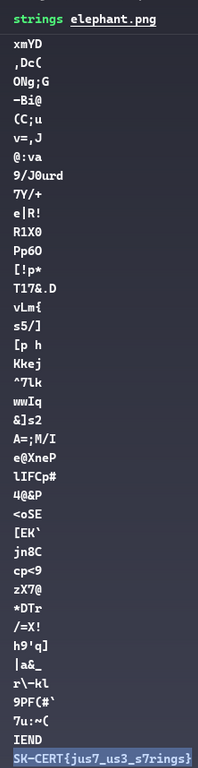
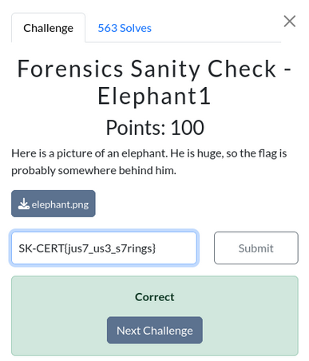

# Desafio: Forensics Sanity Check - Elephant

Dada la descripción del desafio: *"Here is a picture of an elephant. He is huge, so the flag is probably somewhere behind him."* y la siguiente imagen provista de un elefante:

Suponemos que la flag no se encuentra literalmente en la imagen, sino que *"detras"* de ella puede referirse a sus metadatos, por lo que procedemos a ejecutar el comando **strings** para leer cualquier texto legible incrustado en el código del archivo.

Al hacerlo logramos obtener la flag escondida en la imagen, por lo que finalizamos subiendola a la plataforma.
