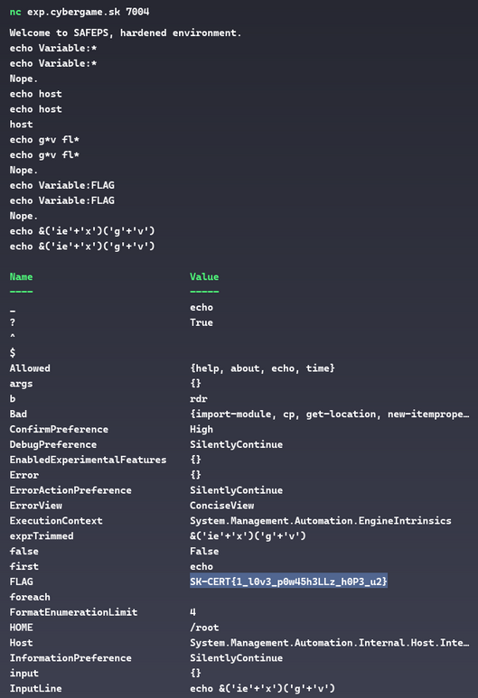
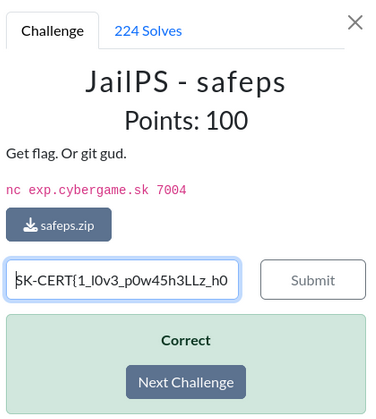

# Desafio: JailPS - safeps

Dada la descripción del desafio: *"Get flag. Or git gud. **nc exp.cybergame.sk 7004**"* y un .zip con el proyecto, el cual consta de los archivos **docker-compose** y **script.ps1** los cuales se encargan de iniciar un contenedor que permite ejecutar la terminal Powershell de Windows sobre Linux y montando en él un script, logrando asi abrir instancias de una powershell en cada conexion al servidor. Este script se encarga principalmente de recibir los comandos ingresados, filtrarlos y decidir su ejecucion, utilizando listas negras y blancas de comandos, y filtros de caracteres permitidos.

Al analizar el código del servicio detectamos que los filtros aplicados al comando **echo** permite la ejecución de comandos de forma limitada, dado que la validación de comandos ingresados entre comillas dobles " " se realiza sobre substrings pero permite la concatenación de substrings, por lo que un comando puede formarse diviendo ese substring en varios substrings, por ejemplo se puede ingresar **'ie'+'x'** (ya que no contiene la subcadena **iex**) pero al ejecutarse forma el comando **iex**. Por lo tanto, podriamos utilizar la combinación de comandos como **iex** y el alias **gv** para listar variables de sesión sin nombrarlas.

Al hacerlo logramos obtener la lista de variables del sistema, incluida la variable FLAG.
