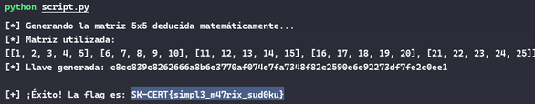
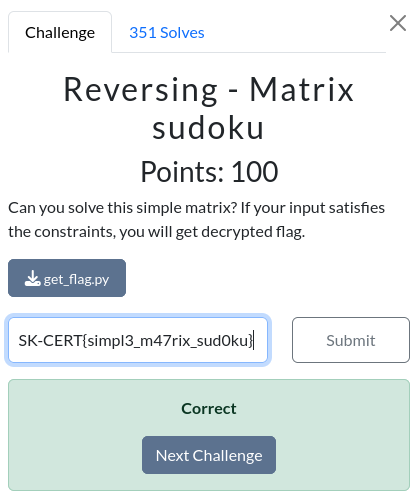

# Desafio: Reversing - Matrix sudoku

Dada la descripción del desafio: *"Can you solve this simple matrix? If your input satisfies the constraints, you will get decrypted flag."* y un archivo **get_flag.py** el cual recibe una lista de 25 números enteros del 1 al 25, es decir, una matriz o sudoku de 5x5, y comprueba que esta pase 7 validaciones matemáticas, donde si la matriz es correcta, se convierte en un string, se le aplica un hash SHA-256 y ese hash actúa como la llave (key) para desencriptar la flag usando AES-CBC.

Al analizar este script nos damos cuenta que los valores de las sumas de los elementos de cada fila (15,40,65,90,115) son los resultados exactos de sumar grupos de 5 números consecutivos del 1 al 25. Esto nos permitió deducir la matriz sin usar fuerza bruta. Por lo que para resolver el desafio se definio el archivo **script.py** el cual se encarga de construit la matriz correcta programáticamente, donde luego al convertir esta matriz a un string se genera el mismo hash que el original utilizando SHA-256, obteniendo asi la key para descifrar la flag utilizando AES-CBC.
Finalmente, luego de ejecutar este script es posible obtener la flag.

