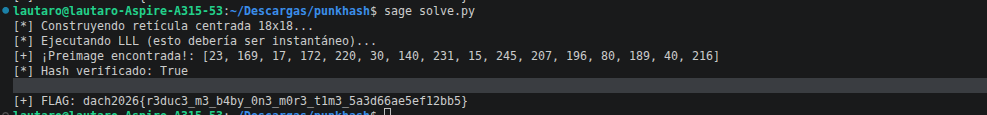

# Desafio: PunkyHash - Lattice Attack (LLL)

## 1. Análisis del Problema
El reto presenta la siguiente descripción *"Look at this punky hash I found. Can you crack it?"* y los archivos **generate.py** y **data.json** los cuales definen un sistema de hashing personalizado donde se genera un `hash` a partir de una preimagen de 16 bytes (la llave AES) y una lista de factores aleatorios, todo bajo un módulo primo `p` de 137 bits.

La ecuación fundamental es:
    
    hash = sum(factors[i] * preimage[i]) mod p

Donde:
- preimage[i] son bytes individuales (rango 0-255).
- factors[i] y p son conocidos (dados en data.json).
- El objetivo es recuperar la preimagen para usarla como llave AES y descifrar la flag.

## 2. La Vulnerabilidad: Knapsack / Subset Sum Problem
Este es un caso clásico de "Shortest Vector Problem" (SVP). Como los coeficientes de la preimagen son muy pequeños (máximo 255) en comparación con el módulo p (~2^137), podemos modelar el problema como una búsqueda de vectores cortos en una retícula (lattice).

## 3. Construcción de la Retícula (Lattice)
Para resolverlo, implementamos un ataque de **Kannan’s Embedding** con una técnica de **Centrado de Rango** en el archivo **solve.py**.

### El Problema del Rango [0, 255]
LLL funciona mejor cuando los valores buscados están centrados en cero. Si buscamos valores de 0 a 255, el "vector nulo" (todo ceros) siempre parece más corto que la solución real.

### La Solución: Centrado en 128
Transformamos la búsqueda para encontrar valores en el rango [-128, 127]. Definimos:
x_i = y_i + 128
Sustituyendo en la ecuación:
sum(factors[i] * y_i) = (hash - sum(factors[i] * 128)) mod p

### Estructura de la Matriz (18x18)
Construimos una matriz donde las filas representan la base de la retícula:
- Filas 0-15: Identidad (para los coeficientes y_i) combinada con los factores multiplicados por un peso (Scale).
- Fila 16: El módulo p (para manejar la aritmética modular).
- Fila 17: El Target Hash (el valor que queremos alcanzar).

Al aplicar el algoritmo **LLL (Lenstra-Lenstra-Lovász)**, el software busca una combinación lineal de estas filas que resulte en un vector extremadamente corto. El vector más corto encontrado contiene los valores y_i desplazados.

## 4. Resolución
1. Se calcula el "Target Hash" desplazado restando el peso de los 128 de cada factor.
2. Se escala la columna de la ecuación modular con un factor de 2^150 para forzar a LLL a encontrar una solución exacta (error cero).
3. Se ejecuta LLL en SageMath.
4. Se recuperan los bytes originales sumando 128 a los valores hallados.
5. Se utiliza la preimagen resultante como llave AES-256-ECB para descifrar la flag.

## 5. Resultados
Flag obtenida:
