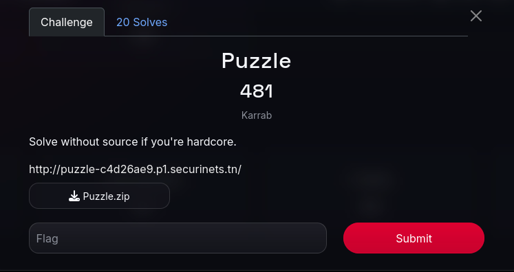
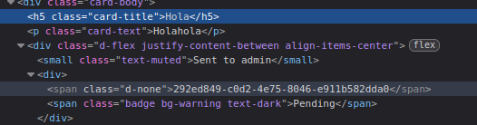
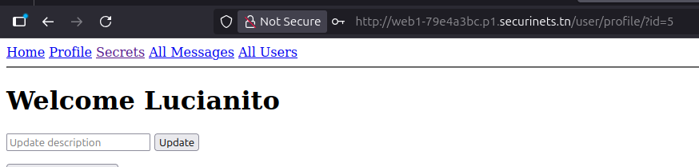

## Securinets CTF

### Puzzle - Web



El reto comienza dandonos una copia del código con un Dockerfile para replicar el entorno. Dentro del código, hay muchas rutas divididas en dos bloques principales: *auth.py*, donde se encuentran las rutas relacionadas a registro, y *routes.py*, donde están el resto de las rutas. Analizando el código, vemos que hay distintos roles: usuario, editor y admin. Es lógico suponer que nuestro objetivo es loguearnos como admin. Al registrar un usuario, vemos en la ruta *confirm-register* que podemos manipular el formulario para crearnos un usuario **editor**, pero no un admin. Creamos un script para esto (Script.py) y lo ejecutamos.  
Estar logueados como editor nos permite el acceso a distintas rutas que ser usuario no nos permite. Principalmente, vemos que podemos acceder a la ruta */users/<uuid>*. En esa ruta podremos acceder a la información de cualquier usuario, ya que no hay ningún tipo de control de accceso y, sobre todo, las contraseñas están guardadas en texto plano. Por tanto, nuestro objetivo es conseguir el uuid del admin.  
Analizando el resto de las rutas de **routes.py** vemos que podemos crear artículos con colaboradores, y esto crea una entrada en la tabla *collab_requests* con los **uuid** de los participantes. Esto podemos hacerlo directamente desde la página con el nombre de nuestro colaborador, que será **admin**. Nuestro objetivo ahora será acceder a esta collab_request. Vemos que hay dos rutas que acceden a esta tabla y que potencialmente podrían servirnos: *collab/request* y *collab/requests*. Sin embargo, ambas tienen una protección para que solo pueden ser accedidas desde el propio contenedor Docker do  nde están almacenadas, y es una protección que no podemos vulnerar.  
Nos enfocamos entonces en la ruta */collab/accept/<string:request_uuid>*. Analizandola, vemos que la ruta permite aceptar una colaboración, lo que publicaría el artículo. La ruta no tiene ningún tipo de control de acceso: no chequea quién es la persona que está accediendo ni que esta persona sea la misma a la que se le solicitó la colaboración, simplemente, chequea que sea un usuario existente y que no sea admin. Para entrar a esta ruta es necesario tener el **uuid** de la request. Este es un dato que aparece "oculto" en el listado de colaboraciones.  
  
Una vez con este dato, enviamos la request con curl

```bash
❯ curl -X POST http://<ruta>/collab/accept/<request-uuid> \
  -b "session=cookie-del-usuario-editor"
```

  
Esto nos acepta la colaboración y publica el artículo. Podemos ver los artículos en el navegador, e inspeccionando el código podremos ver el **uuid** de los colaboradores.    
Con esta información, finalmente podemos acceder a la información del administrador.  
  

Logueado como administrador, puedo entrar al panel de admin, que me da acceso a una ruta muy sospechosa llamada *ban_users*. Después de dar muchas vueltas, veo que finalmente esa ruta no me es útil. Estando como administrador tambien tengo acceso a la ruta */data* donde encuentro dos archivos: **secrets.zip** y **db_connect.exe**. El zip tiene una contraseña que lo protege, intento forzarla con **john** y con **fcrackzip** sin exito. Me vuelco al otro archivo y lo analizo con **strings**, allí encuentro las credenciales de la base de datos, entre ellas la contraseña. Pruebo esta contraseña en el .zip y finalmente encuentro la flag.  
  


### S3cret5 - Web


El reto comienza con un formulario de login y register. Nuevamente nos dan el código y, lo que se asume, es que tenemos que escalar a admin, ya que hay varias rutas a las que no podemos acceder, y todo está debidamente protegido. Sin embargo, existe la función */report* que, de entrada, se ve muy sospechosa.  

```js
router.post("/", authMiddleware, async (req, res) => {
  const { url } = req.body;

  if (!url || !url.startsWith("http://localhost:3000")) {
    return res.status(400).send("Invalid URL");
  }

  try {
    const admin = await User.findById(1);
    if (!admin) throw new Error("Admin not found");

    const token = jwt.sign({ id: admin.id, role: admin.role }, JWT_SECRET, { expiresIn: "1h" });

    // Launch Puppeteer
    const browser = await puppeteer.launch({
      headless: true,
      args: ["--no-sandbox", "--disable-setuid-sandbox"],
    });

    const page = await browser.newPage();

    // Set admin token cookie
    await page.setCookie({
      name: "token",
      value: token,
      domain: "localhost",
      path: "/",
    });

    // Visit the reported URL
    await page.goto(url, { waitUntil: "networkidle2" });
    const html = await page.content();

    await browser.close();

    res.status(200).send("Thanks for your report");
  } catch (error) {
    console.error(error);
    res.status(200).send("Thanks for your report");
  }
});
```

Lo que se ve acá es que, al reportar una ruta, un **pupeteer** con privilegios de admin visita esa ruta. A partir de esto, intenté enviar muchos payloads tanto a los mensajes como a los secretos para luego reportarlos e intentar que el pupeteer los ejecute como admin. Nada de esto funciono porque todas las vistas están correctamente salvadas contra XSS reflejado y almacenado.  
Lo que tenemos es qué un admin va a visitar la página que le indiquemos, pero no podemos manipularlo para que haga nada más. Excepto que, la misma página envíe algo al ser visitada. Es el caso de *profile.ejs*. En esa vista hay un script que envía un log al visitarla.

```js
fetch("/log/"+profileId, {
        method: "POST",
        headers: { "Content-Type": "application/json" },
        credentials: "include",
        body: JSON.stringify({
          userId: "<%= user.id %>", 
          action: "Visited user profile with id=" + profileId,
          _csrf: csrfToken
        })
      })
      .then(res => res.json())
      .then(json => console.log("Log created:", json))
      .catch(err => console.error("Log error:", err));
```

Convenientemente, el log es un POST que envía el userId del usuario actual. Si manipulamos la variable profileId, podemos enviar un POST a otro lado con nuestro userId en el cuerpo del POST. La ruta a la que hay que enviarlo es a la de *addAdmin*, que envía un POST con un id para convertilo en admin. Sin embargo, esta ruta requiere que el usuario que la envía se admin, por eso necesitamos que la envie el pupeteer.  
Ingresando el payload *http://localhost:3000/user/profile/?id=5&id=../admin/addAdmin* forzamos al pupeteer a que vaya a nuestro perfil y a la vez manipulamos la variable para redireccionar el fetch. Con esto nos convertimos en admin.

  


A partir de acá, no pude resolverlo. Mi sospecha principal y la estrategia que probé fue un ataque de SQLi sobre la función del Model me msgs *findAll*, con el fin de extraer la flag de la tabla **flags** (los *console.log* son propios para debug):

```js
findAll: async (filterField = null, keyword = null) => {
    const { clause, params } = filterHelper("msgs", filterField, keyword);

    const query = `
      SELECT msgs.id, msgs.msg, msgs.type, msgs.createdAt, users.username
      FROM msgs
      INNER JOIN users ON msgs.userId = users.id
      ${clause || ""}
      ORDER BY msgs.createdAt DESC
    `;

    console.log("[DEBUG] Query construida:", query);
    console.log("[DEBUG] Parámetros:", params);

    const res = await db.query(query, params || []);
    return res.rows;
  },
```

Esto llama al helper *filterHelper* para ayudarlo a construir la claúsula por la que filtra.

```js
function filterBy(table, filterBy, keyword, paramIndexStart = 1) {
  if (!filterBy || !keyword) {
    return { clause: "", params: [] };
  }

  const clause = ` WHERE ${table}."${filterBy}" LIKE $${paramIndexStart}`;
  const params = [`%${keyword}%`];

  return { clause, params };
}
```

Por la forma en que está construida la query, el parámetro *keyword*, que es el que nosotros podemos controlar desde el formulario de la web, está correctamente salvado y parametrizado. Pero el parámetro *filterBy* no, y es vulnerable a SQLi. Sin embargo, por la manera en que está construida la query, no logré armar el payload adecuado: las comillas entre las que está encerrado el parámetro en el String de js y la forma en que está construido el string me impedían comentar el resto de la query, por lo que no pude lograr una sentencia que incluya al LIKE y al ORDERBY siguientes con un UNION que me permitan extraer la flag. Probé muchos payloads, algunos de los cuales quedaron guardados en el script *postAMessage.py*, pero no logré dar con el adecuado.