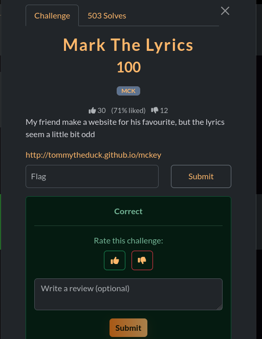
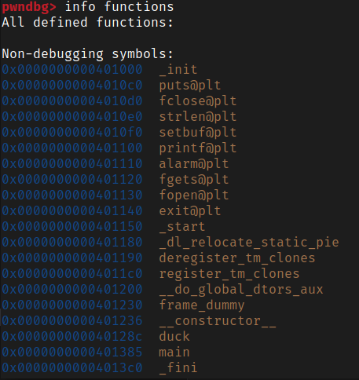

# V1t CTF

## Login - Web

**Flag**: v1t{p4ssw0rd}

Para resolver el reto nos dan una URL donde debemos loguearnos. Cuando analizamos la página en cuestión, vemos que no tiene ningún contenido en el body salvo un **script**.  

```javascript
    async function toHex(buffer) {
      const bytes = new Uint8Array(buffer);
      let hex = '';
      for (let i = 0; i < bytes.length; i++) {
        hex += bytes[i].toString(16).padStart(2, '0');
      }
      return hex;
    }

    async function sha256Hex(str) {
      const enc = new TextEncoder();
      const data = enc.encode(str);
      const digest = await crypto.subtle.digest('SHA-256', data);
      return toHex(digest);
    }

    function timingSafeEqualHex(a, b) {
      if (a.length !== b.length) return false;
      let diff = 0;
      for (let i = 0; i < a.length; i++) {
        diff |= a.charCodeAt(i) ^ b.charCodeAt(i);
      }
      return diff === 0;
    }

    (async () => {
      const ajnsdjkamsf = 'ba773c013e5c07e8831bdb2f1cee06f349ea1da550ef4766f5e7f7ec842d836e'; // replace
      const lanfffiewnu = '48d2a5bbcf422ccd1b69e2a82fb90bafb52384953e77e304bef856084be052b6'; // replace

      const username = prompt('Enter username:');
      const password = prompt('Enter password:');

      if (username === null || password === null) {
        alert('Missing username or password');
        return;
      }

      const uHash = await sha256Hex(username);
      const pHash = await sha256Hex(password);

      if (timingSafeEqualHex(uHash, ajnsdjkamsf) && timingSafeEqualHex(pHash, lanfffiewnu)) {
        alert(username+ '{'+password+'}');
      } else {
        alert('Invalid credentials');
      }
    })();
```

En el script, vemos que nos pide un username y una password, a eso le aplica un hash SHA256 y lo compara con las variables donde tiene guardado el hash del username y la password. Por tanto, lo que debemos hacer es buscar la palabra que, al aplicarle el hash SHA256, sea igual a los hashes ahi expuestos. Hay diferentes herramientas online que pueden hacer eso, entre ellas "hashes.com".  
Buscamos ambos hashes y obtenemos el username y la password:  

  
Una vez obtenidas, nos logueamos y eso nos devuelve la flag:  
  
Que nos permite completar el ejercicio:  


## Stylish Flag - Web

**Flag**: v1t{h1d30ut_css}

Es un reto de manipulación de CSS. Nos dan un URL donde al ingresar solo vemos esto.  
  
Si vamos al inspector, podemos ver en el html un div oculto llamado "flag".  

```html
  <h1>where is the flag ;-;</h1>
  <br>
  <div hidden="" class="flag"></div>
```

A partir de esto, podemos manipular el css en la consola para que nos muestre lo que hay en ese div. En primer lugar, lo más importante es remover el atributo "hidden". Luego de hacerlo, vemos que la flag esta pero no se ve clara. Empezamos a manipular diferentes elementos hasta que finalmente llegamos a esto, que, en resumidas cuentas, gira el div porque estaba rotado, lo posiciona en un lugar de la pantalla donde no se superponga con el h1, lo vuelve mas opaco para que se vea mejor, lo trae hasta "adelante" del todo en la pantalla, etc:

```javascript
const flag = document.querySelector('.flag');
flag.removeAttribute('hidden');
flag.style.position = 'fixed';
flag.style.top = '70%';
flag.style.left = '20%';
flag.style.transform = 'translate(-50%, -50%)';
flag.style.opacity = '1';
flag.style.background = '#000';
flag.style.border = '1px solid white';
flag.style.zIndex = '9999'; 
```

Esto nos permite ver claramente la flag:  
  
La ingresamos y nos da el reto resuelto:  
  

### Mark the lyrics - Web

**Flag**: V1T{MCK-pap-cool-ooh-yeah}

Nos dan una página donde hay letras de canciones inentendibles. Inspeccionando el código vemos que algunos elementos, aparentemente al azar, están marcados con la etiqueta `<mark></mark>`. Si reconstruimos el contenido de esas etiquetas, nos da la flag.  



## Waddler - PWN

**Flag**: v1t{w4ddl3r_3x1t5_4e4d6c332b6fe62a63afe56171fd3725}
**Recurso**: chall

El reto consiste en conectarte a un servidor remoto donde podemos enviar algo para que nos de una respuesta. Incluyen el ejecutable que está corriendo en el servidor remoto.  


Haciendo uso de las herramientas de **pwn** podemos analizar el ejecutable para ver varias cosas. Antes de eso, utilice la herramienta **strings** y al analizar la salida pude ver algunas cosas interesantes:  
  
Esto nos muestra que hay un archivo flag.txt al que accede el ejecutable de alguna manera, lo que nosotros debemos lograr es que llegue ahi. Seguramente haya una función que ejecute esa parte, y nosotros debemos lograr ejecutar esa función a través de un desbordamiento y sobreescribiendo la dirección de retorno. Usando **objdump** vemos una función llamada "duck" que es la que efectivamente hace eso. Lo que debemos averiguar ahora es, por un lado, el tamaño del buffer que debemos desbordar, y por otro, la dirección donde está "duck".  
Para esto si hacemos uso de **pwndgb**, ejecutando el archivo que nos brindan, y al hacer `info functions` vemos la dirección de duck. Como el ejecutable no tiene ninguna protección activada, salvo NX que para esto es indistinto, sabremos que en el servidor remoto, la función estará en el mismo lugar.  
  
Nos falta saber el tamaño del offset. Para esto podemos usar la herramienta **cyclic** y ver en que parte se rompe.  
   
Con todo esto en mente, armamos el template de pwn, que está en *Waddler.pwn/exploit.py*, para enviar al servidor remoto. Lo ejecutamos y obtenemos la flag.  


